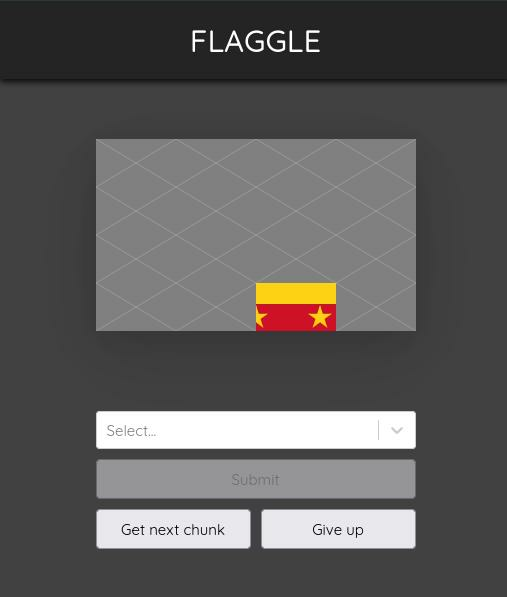
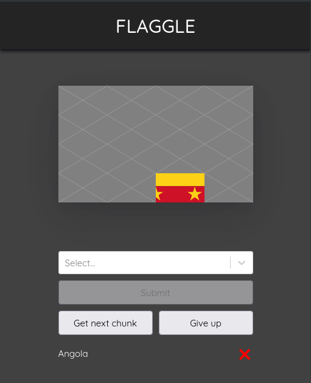
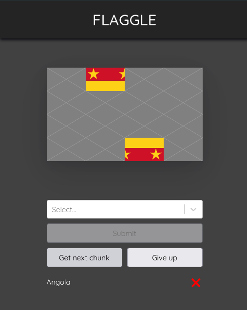
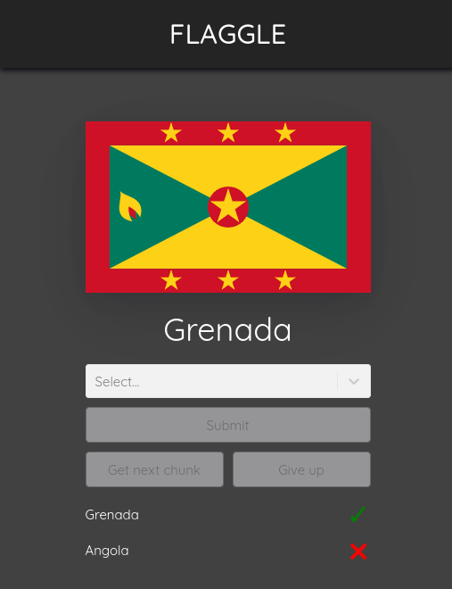

<h1 align="center">
    Flaggle
</h1>

<p align="center">
    The flag-guessing game.
</p>
<br/>
<br/>
<br/>
<br/>

# What it is

A simple guessing game where you are presented with pieces of an image. The image is of a flag, and you need to guess which country the flag belongs to. If you do not know, you can reveal the next piece of the flag, or you can skip it.

<details>
<summary>Click to see screenshots!</summary>





</details>

# Running locally

You will need to start by cloning this repo:

```
git clone https://github.com/devklick/flaggle.git
```

Then install the package:

```
npm i
```

A postgres database is required to run the game, and the most convenient way to get started is to use docker to run a container with postgres installed. For example: 

```
docker run --name flaggle-postgres -p 5432:5432 -e POSTGRES_PASSWORD=postgres -d postgres
```

(See the [official docs](https://hub.docker.com/_/postgres) for more on this.)

Once you have the container running, you will need to create a database called `flaggle`. Connect to the postgres server with client of your choice and run the create database script:

```sql
CREATE DATABASE flaggle;
```

If you used a different username, password or post when running your postgres container, you will need update the [env](./.env) file the correct values. Otherwise if you used the ones mentioned here, you can skip this step. 

Next, the database schema needs to be deployed. We can do this with the prisma cli as follows, which will update to the latest [migration](./libs/flaggle-db/src/lib/migrations/)):

```
npx prisma db push
```

Now that we have the database schema ready, we need to seed the data required by the game. Again, we use the prisma CLI to do this:

```
npx prisma db seed
```
Ths process may take a minute or so, as the seed process has to pull down country data from [restcountries](https://restcountries.com), download the flag images, split them up into chunks, and save the chunks to your local file system.

(Note, sometimes the prisma CLI does not close properly, co you may need to hit `Ctrl + c` to exit out of it.)

Now we're ready to run the application. To do so, we can simply run:
```
npm start
```
This will go off and run the API and UI in parallel. 

# Technologies Used

- [Nx](https://nx.dev/)
- [React](https://reactjs.org/)
- [Express](https://expressjs.com/)
- [Prisma](https://www.prisma.io/)
- [PostgreSql](https://www.postgresql.org/)

# Services Used

- [Rest Countries](https://restcountries.com)
